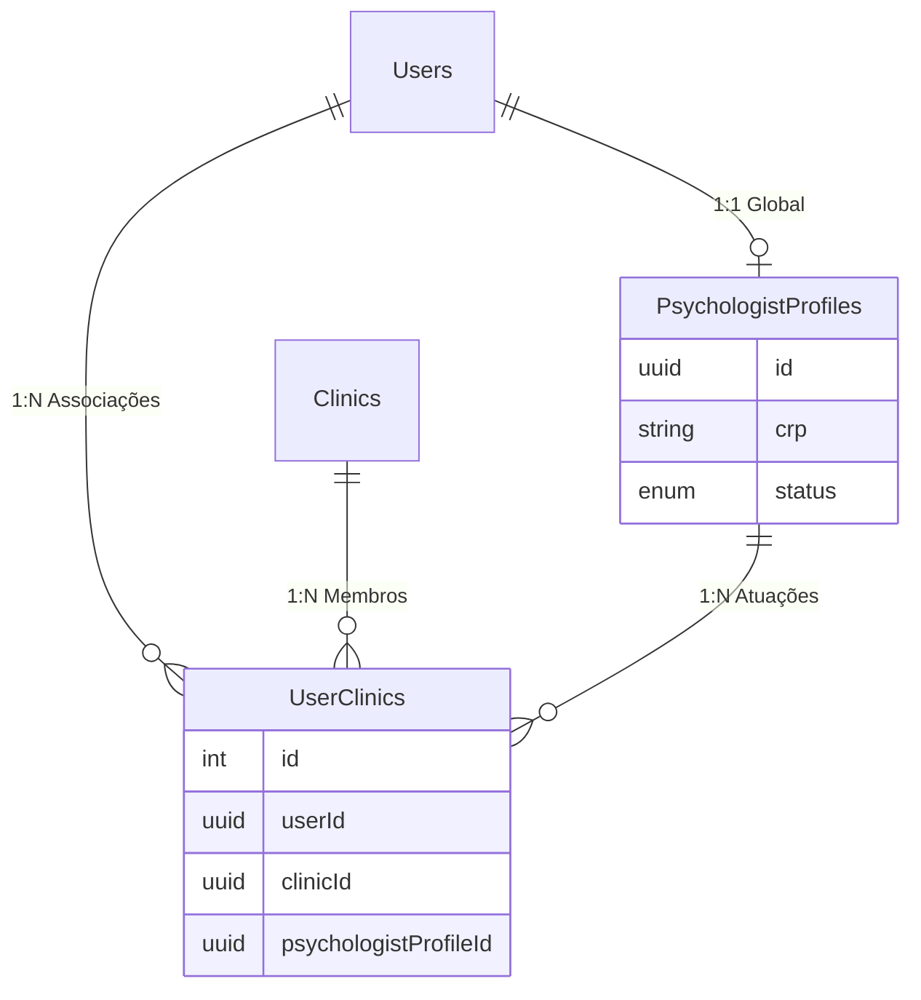
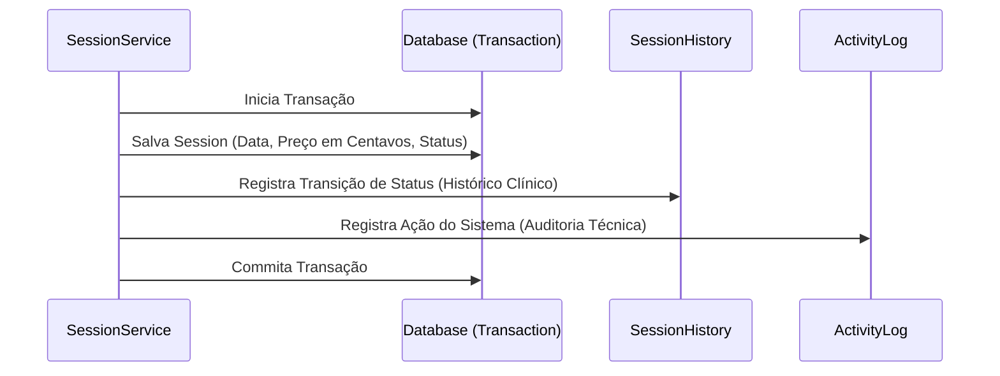

# Arquitetura de Perfis e Agendamento

Este documento explica como as entidades de Psicólogo, Clínica e Sessões se relacionam no sistema após a refatoração híbrida.

## 1. Estrutura de Perfis (Psicólogo)

Adotamos um modelo **híbrido** para suportar tanto o cadastro global do profissional quanto sua atuação multi-clínica.



### Como funciona:
- **Perfil Global**: O `PsychologistProfile` é único por `User`. Ele guarda dados que não mudam entre clínicas, como o **CRP**. É criado no onboarding assim que o usuário informa que é psicólogo.
- **Associação por Clínica**: O `UserClinic` é o que define que um usuário pertence a uma clínica. Se esse usuário for atuar como psicólogo naquela clínica específica, o `UserClinic` dele terá um vínculo (`psychologist_profiles_id`) com o seu perfil global.
- **Vantagem**: Um psicólogo pode atender em 3 clínicas diferentes usando o mesmo CRP, e o sistema sabe exatamente quem ele é em cada contexto.

---

## 2. Fluxo de Agendamento e Auditoria

As sessões possuem uma estrutura de "Dupla Camada de Histórico":



### Detalhes técnicos:
- **Preço**: Sempre guardado como `integer` em centavos (ex: R$ 150,00 = `15000`) para evitar erros de precisão decimal.
- **SessionHistory**: Focado no domínio. "A sessão mudou de AGENDADA para CANCELADA pelo motivo X".
- **ActivityLog**: Focado em segurança e trilha técnica. "O Usuário A criou a entidade Sessão ID B na Clínica C".

---

## 3. Próximos Passos: Migrations

Sim, você **precisa rodar migrations**. Como alteramos entidades existentes (`User`, `UserClinic`) e criamos novas (`Session`, `ActivityLog`), o banco precisa ser atualizado.

### Passos recomendados:
1.  **Gerar a Migration**: No seu terminal, rode o comando:
    ```bash
    npm run migration:generate src/database/migrations/ImplementSessionsAndRefactorProfiles
    ```
2.  **Revisar**: Olhe o arquivo gerado para garantir que ele está criando as tabelas `sessions`, `activity_logs`, `session_histories` e adicionando a coluna em `user_clinics`.
3.  **Aplicar**:
    ```bash
    npm run migration:run
    ```
